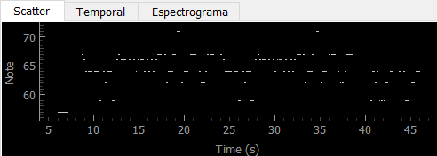
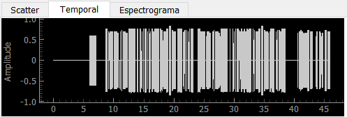
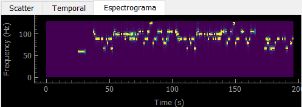
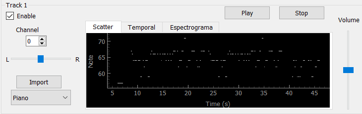
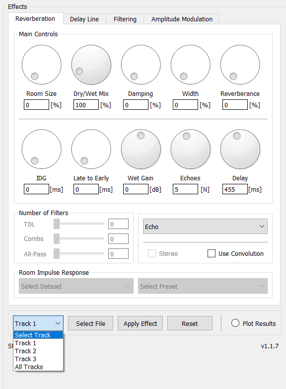
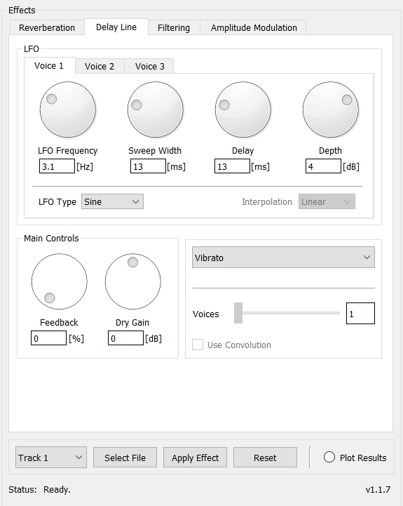

# Programa de Síntesis de Pistas MIDI

Este programa tiene como objetivo sintetizar pistas de audio a partir de archivos MIDI (.mid), permitiendo asignar instrumentos a cada pista, mezclar los distintos tracks, agregar efectos y reproducir los tracks individualmente o la pista total con estas mejoras.

*Fig. 1: Grafico de la Interfaz del programa*

## Funcionalidades

- **Cargar Archivo MIDI:** Al activar el boton de *Enable* de un track en especifico se le habilita al usuario el boton de *Import* con el cual se le permite cargar un archivo en formato MIDI y reproducri un *Channel* en especifico para su procesamiento. Dentro del mismo se pueden observar 3 tipos de graficos del track:
    - Grafico de Nota en funcion del Tiempo
        
        

    - Grafico Amplitud en funcion del Tiempo
        

    - Espectrograma del track
        

- **Asignar Instrumentos:** Una vez asignada la pista a un track en especifico, se le permite al usuario sintetizar la pista con cualquier instrumento que se encuentra dentro del menu desplegable. Entre estos se encuentran diferentes tipos de instrumentos tales como:
    - Piano
    - Guitarra
    - Hihat
    - Kick
    - Clarinete
    - Tuba
    - Saxo
    - Snare

Una vez seleccionado el instrumento el programa ejecutara la sintesis del intrumentos. Una vez finalizada, se activara el boton de *Play* que se encuentra en la parte superior de cada track y mediante su ejecucion le permitira al usuario escuchar el track sintetizado con el instrumento seleccionado. Como agregado cada track tiene un control de volumen y de panning el cual le permite al usuario modificar estos valores a cada track y ver su resultado en la pista final 

- **Mezclar Tracks y Espectrograma:** Mediante el boton de *Play* ubicado en la parte superior derecha se combinan los distintos tracks y se genera una pista única, la cual se reproduce a la salida. Al igual que para cada track, se adiciono un control de panning de la pista total. 

- **Agregar Efectos:** Permite agregar y configurar diferentes efectos tanto para cada track como para la mezcla total, incluyendo delay y reverberación.

- **Visualización del Espectrograma:** En la parte inferior derecha una vez generada la pista total se puede observar el espectrograma de la pista total.

- **Reproducción de Notas y Acordes:** Permite reproducir cualquier nota del instrumento o acordes con cualquier duración.

- **Efectos**  
  Para cada track, como también para la pista en general, se le pueden aplicar diferentes efectos tales como efectos de reverberación y efectos de delay. Para ello, mediante el menú ubicado en la parte inferior de la pestaña de efectos, se debe seleccionar el track a modificar y a continuación el botón de *Apply Effect*.

  
  *Fig. 1: Pestaña de efectos de Reverberation*

  
  *Fig. 2: Pestaña efectos de Delay*

## Prestaciones Implementadas

- **Síntesis Aditiva o FM:** Se ha implementado la síntesis aditiva para la creación de un instrumento.
- **Síntesis por Modelado Físico:** Se ha implementado la síntesis por modelado físico para recrear características específicas de algunos instrumentos.
- **Síntesis por Muestras:** Se ha implementado la síntesis por muestras para generar sonidos realistas basados en muestras pregrabadas.
- **Delay y Reverberación:** Se han incorporado efectos de delay y reverberación para enriquecer el sonido final.

## Instalación

Para instalar este proyecto, sigue estos pasos:

1. Clona el repositorio: `git clone https://github.com/AgusSolari/assd_tp2_synth`
2. Navega al directorio del proyecto
3. Instala las dependencias: `pip install -r requirements.txt`

## Instrucciones de Uso

1. **Cargar Archivo MIDI:** Selecciona el archivo MIDI que deseas procesar.
2. **Asignar Instrumentos:** Asigna los instrumentos deseados a cada pista del archivo MIDI.
3. **Agregar Efectos:** Configura los efectos deseados para cada pista y para la mezcla total.
4. **Generar Pista:** Procesa la pista de audio con las configuraciones establecidas.
5. **Guardar Pista:** Guarda la pista generada en el formato de audio preferido.
6. **Visualizar Espectrograma:** Analiza el espectrograma del audio generado para evaluar su calidad.

## Ensayos

Para demostrar la funcionalidad del programa, se recomienda ensayar con un fragmento considerable del segundo movimiento (Adagio) del Concierto de Aranjuez, de Joaquín Rodrigo. Puedes encontrar archivos MIDI de esta obra como la de demas artistas en la carpeta mid_files dentro de src

---

